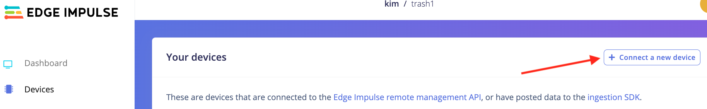

# Trash Detector
Trash Detector ist ein Uniprojekt, im Rahmen des HTW Wahlpflicht-Mastermoduls Wissensmanagement, im Studiengang Wirtschaftsinformatik. Inhalt und Ziel des Moduls war die Erstellung eines Hardware-Prototypen mit einem Microcontroller und die Verwendung von Machine Learning.

*Hinweis: Der hier vorgestellte Prototyp basiert zu diesem Zeitpunkt auf hard-gecodeten Ausgabewerten und gibt keine Echtdaten aus. Dies kann jedoch erzielt werden, wenn eine Hardware mit mehr Arbeitsspeicher verwendet wird. Die hier verwendete Hardware bietet nur einen begrenzten Speicher von 1 MB an.*

## Inhaltsverzeichnis

- [1 Einleitung](#kap1)
  - [1.1 Motivation](#kap1-1)
  - [1.2 Ziel des Projektes](#kap1-2)
- [2 Aufbau und Vorbereitung des Prototypen](#kap2)
  - [2.1 Hardwarekomponenten](#kap2-1)
  - [2.2 Edge Impulse](#kap2-2)
  - [2.3 Arduino IDE](#kap2-3)
- [3 Umsetzung und Anleitung](#kap3)
  - [3.1 Hardware vorbereiten](#kap3-1)
  - [3.2 Daten](#kap3-2)
    - [3.2.1 Datensatz erstellen mit eigener Handykamera](#kap3-2-1)
    - [3.2.2 Labels und Klassifizierung](#kap3-2-2)
    - [3.2.3 Datensatz und verwendete Objekte](#kap3-2-3)
  - [3.3 Modell trainieren](#kap3-3)
  - [3.4 Code in Arduino IDE](#kap3-4)
    - [3.4.1 Müllerkennung](#kap3-4-1)
    - [3.4.2 Bluetooth auf Nano 33](#kap3-4-2)
    - [3.4.3 Bluetooth auf M5StickC Plus](#kap3-4-3)
  - [3.5 Ausgabe auf M5Stick](#kap3-5)
- [4 Potenziale und Ausblick](#kap4)
- [5 Trouble shooting](#kap5)
- [Weiterführende Links](#kapLinks)
- [Literaturverzeichnis](#kapLit)


<a name="kap1"></a>
## 1 Einleitung
Müll ist ein globales Problem, das sich auf die Umwelt und die Gesellschaft auswirkt. Der Anstieg des Müllaufkommens und die begrenzten Möglichkeiten zur Entsorgung haben negative Auswirkungen auf die Gesundheit der Menschen, die Tiere und die Umwelt.[^1] Um diesen Herausforderungen zu begegnen, haben sich diverse Länder und Unternehmen darauf konzentriert, Technologien und Verfahren zur Müllerkennung und zum Recycling zu entwickeln.[^2] Müllerkennungs- und Recyclingtechnologien helfen dabei, Abfall zu reduzieren, wertvolle Ressourcen zurückzugewinnen und die Umweltbelastung zu minimieren. In diesem Zusammenhang sind auch innovative Lösungen wie künstliche Intelligenz und maschinelles Lernen im Bereich der Müllerkennung und des Recyclings auf dem Vormarsch.\
Dieses Projekt ist ein Prototyp und der erste Schritt für die Verwendung von Technologien zur Müllerkennung.

<a name="kap1-1"></a>
### 1.1 Motivation
Mithilfe von Technologie können Vebraucher dabei unterstützt werden, bereits während der Entsorgung von Müll ihren Teil zum Recycling und somit zu einer nachhaltigeren Welt beizutragen. Dieser Protoyp soll ein erster Schritt für den Einsatz von Microcontrollern in der Müllerkennung sein, um Abfall zu reduzieren, wertvolle Ressourcen zurückzugewinnen und die Umweltbelastung zu minimieren. 

<a name="kap1-2"></a>
### 1.2 Ziel des Projektes
Das Ziel dieses Projektes ist die Müllerkennung mithilfe von Machine Learning (TinyML) und eines Microcontrollers.
Die Effizienz und Effektivität der Müllsortierung soll verbessert werden und dadurch ein Beitrag zu einer nachhaltigeren Zukunft geleistet werden. Durch die Verwendung von Microcontrollern zur Müllerkennung und zum Recycling kann Abfall besser klassifiziert werden und somit eine automatische Trennung und Weiterverarbeitung von Abfall ermöglichen. Dies wiederum reduziert die Müllentsorgungskosten, maximiert den Wert wiederverwendbarer Ressourcen und reduziert die Umweltbelastung.

Konkret soll der Prototyp dazu beitragen, dass der Müllsortierprozess effizienter wird, indem er die Müllerkennung automatisiert und somit menschliche Fehler minimiert. Durch die Erkennung von verschiedenen Müllarten auf der Grundlage von Merkmalen wie Farbe, Form und Struktur kann eine Trennung und Weiterverarbeitung von Abfall ermöglicht werden.

Umgesetzt wird dies durch die visuelle Aufnahme von verschiedenen Müllarten. Bildmaterial von Müll wird dabei klassifiziert und erhalten Labels, womit später das TinyML-Modell trainiert und getestet wird. Über die Kamera wird nahezu live der Müll erkannt und die Müllart auf einem separaten Display ausgegeben.

Ziel ist nicht die Erstellung eines fertigen Prototypen oder eine vollwertig funktionierenden Hard- und/oder Software.

<a name="kap2"></a>
## 2 Aufbau und Vorbereitung des Prototypen
In diesem Abschnitt wird gezeigt, welche Vorbereitungen getroffen werden müssen, um den Prototypen zum Laufen zu bringen.

<a name="kap2-1"></a>
### 2.1 Hardwarekomponenten
Für den Prototypen sind drei Hardwarekomponenten relevant, um den Müll zu erkennen und die erkannte Müllart auf einem Display auszugeben:
1. Microcontroller **Nano 33 BLE Sense**
2. Kameramodul **OV7675**
3. **M5StickC Plus.**

Die Kommunikation zwischen dem Nano 33 und dem M5StickC Plus wird über Bluetooth umgesetzt, wobei der Nano 33 als zentrales Gerät und der M5StickC Plus als Peripheriegerät fungiert.

1. Der Microcontroller Nano 33 BLE Sense von Arduino ist das Herzstück des Ganzen. Auf diesem Controller wird der Code für die Erkennung des Mülls raufgespielt und zusätzlich der Code für die Bluetoothkommunikation zum Display (M5StickC PLUS).


2. Das Kameramodul dient zur Aufnahme des Objekts.


3. Zum Anzeigen der erkannten Müllart wird der M5StickC Plus verwendet. In ihm steckt ein ESP-32-PICO Mini. Für die Bluetoothkommunikation wird hierauf der Peripheriecode gespielt.


Der Microcontroller und das Kameramodul können über ein Board, das sogenannte *Tiny Machine Learning Shield*, verbunden werden. \


<a name="kap2-2"></a>
### 2.2 Edge Impulse
Edge Impulse ist eine Plattform, um Machine Learning-Modelle zu erstellen, zu trainieren und anschließend zu implemtieren. Zur Vorbereitung sind folgende Schritte notwendig:

1. Konto erstellen / Registrierung auf auf Edge Impulse
2. Neues Projekt anlegen

<a name="kap2-3"></a>
### 2.3 Arduino IDE
Die Arduino IDE ist eine Entwicklungsumgebung, in der später das exportiere Modell aus Edge Impulse importiert werden kann und auch Code zu entwickeln. Der Code dann später über die Arduino IDE auf den Nano 33 hochgeladen werden. Für die Einrichtung sind folgende Schritte notwendig:

1. Download der Arduino IDE: [Arduino IDE](https://support.arduino.cc/hc/en-us/articles/360019833020-Download-and-install-Arduino-IDE)
2. Nach der Installation den Nano 33 über USB an den Computer anschließen und erkannte Libraries installieren. Falls es nicht automatisch erkannt wird, dann folgende Boards im *Boards Manager* suchen und installieren:
  - Arduino AVR Boards by Arduino
  - Arduino Mbed OS Nano Boards by Arduino

3. Folgende Libraries installieren:
  - ArduinoBLE by Arduino
  - Harvard_TinyMLx by TinyMLx Authors

<a name="kap3"></a>
## 3 Umsetzung und Anleitung
In diesem Abschnitt wird die Müllerkennung umgesetzt.

<a name="kap3-1"></a>
### 3.1 Hardware vorbereiten
1. Firmware Nano 33 BLE Sense aktualisieren
* Es kann notwendig sein, erstmal die aktuelle Firmware des Nano zu aktualisieren und zu flashen. Dafür folgende zip-Datei herunterladen und entsprechendes Script für das eigene Betriebssystem öffnen: [Nano 33 BLE Sense board Edge Impulse firmware](https://cdn.edgeimpulse.com/firmware/arduino-nano-33-ble-sense.zip "Nano 33 BLE Sense firmware").


2. Verbinden zu Edge Impulse
* In cmd/Terminal folgenden Befehl eingeben, um den Nano mit Edge Impulse zu verbinden.
```
edge-impulse-daemon
```

3. Triber für Kameramodul/USB-Anschluss runterladen:
* [USB-Treiber von SiLabs](https://www.silabs.com/developers/usb-to-uart-bridge-vcp-drivers "USB-Treiber von SiLabs")

4. Triber/Library für M5StickC
* USB-Triber runterladen: [M5Stick USB-Triber](https://ftdichip.com/drivers/vcp-drivers/)
> Ggfs. muss die Sicherheitseinstellung unter macOS angepasst werden.
> * *System Preferences -> Security and Privacy -> General -> Allow downloadable apps from the following locations -> App Store and Approved Developer Options*

* Arduino IDE öffnen und auf *Arduino IDE -> Settings* gehen und folgenden Link in die Sektion *Additional boards manager URLs* einfügen: 
``https://m5stack.oss-cn-shenzhen.aliyuncs.com/resource/arduino/package_m5stack_index.json``

* Nun Boardtriber für den M5StickC Plus installieren. Dazu unter *Boards Manager* nach *M5Stack* suchen und vorgeschlagenes Board installieren. \


* Nun unter *Tools -> Board: ... -> M5Stack -> M5Stick-C-Plus* auswählen.

* Anschließend die Library installieren. Dazu unter *Library Manager* nach *M5StickCPlus* suchen und vorgeschlagene Library installieren.


<a name="kap3-2"></a>
### 3.2 Daten
Für das Modell werden Daten in Form von Bildern benötigt. Das bedeutet, dass das Modell mit Fotos gefüttert werden muss. Dafür kann ganz einfach das eigene Handy mit dem Projekt in Edge Impulse verknüpft werden, sodass dann das Handy für die Aufnahme von Fotos gentuzt werden kann. Sobald das Handy mit mit dem Projekt verknüpft ist, werden die Fotos direkt in das Projekt geladen.

<a name="kap3-2-1"></a>
#### 3.2.1 Datensatz erstellen mit eigener Handykamera
1. Handy mit Edge Impulse verbinden

* Im Menü auf *Devices* gehen und auf den Button *Connect a new device* wählen. \


* Anschließend bei *Use your mobile phone* auf den Button *Show QR code* klicken. \


* Nun mit dem eigenen Handy den QR-Code scannen. Im Browser sollte nun die Möglichkeit bestehen, Bilder aufzunehmen. Ggfs. müssen Berechtigungen für die Kamera freigegeben werden. Diese bestätigen, da ansonsten keine Fotos aufgenommen werden können.


* Das Label kann über den oberen *Label*-Button geändert werden.

<a name="kap3-2-2"></a>
#### 3.2.2 Labels und Klassifizierung
Für dieses Projekt wurden vier Labels gewählt:

1. *glas* für Glas
2. *kunststoff* für Kunststoff
3. *restmuell* für Restmüll
4. *pappe* für Pappe

Des Weiteren wurde noch testweise das Label *noise* hinzugefügt, um bspw. Umgebungs- und Hintergrundrauschen auszufiltern. Dies erweiste sich jedoch als nicht relevant bzw. hatte keinen sichtbaren Einfluss auf die Genauigkeit der Daten und wird deshalb hier nicht weiter erwähnt.

<a name="kap3-2-3"></a>
#### 3.2.3 Datensatz und verwendete Objekte
In Edge Impulse können nun unter dem Menüpunkt *Data acquisition* alle aufgenommen Bilder eingesehen werden und ggfs. editiert werden, wenn bspw. das Label falsch gesetzt wurde. Auch können hier Bilder wieder gelöscht werden.


Der Datensatz besteht vollständig aus eigenständig aufgenommen Daten, d.h. es wurde kein fremder Datensatz (hinzu)gewählt. Der Train/Test-Split wurde auf 80/20 festgesetzt. Insgesamt wurden 1.047 Trainigsdaten und 251 Testdaten erstellt. Von diesen 1.047 Trainingsdaten sind 278 Aufnahmen von Glas, 242 Aufnahmen von Kunststoff, 267 Aufnahmen von Pappe und 242 Aufnahmen von Restmüll. Für Glas wurde ein durchsichtiges, farbloses Konservenglas vor unterschiedlichem Hintergrund und in unterschiedlichen Winkeln aufgenommen. Für Kunststoff eine Süßigkeiten-Plastik-Tüte, für  Restmüll eine Banane und für Pappe ein zusammengeknülltes Papierstück.

<a name="kap3-3"></a>
### 3.3 Modell trainieren
Um das Modell zu trainieren, nun im Seitenmenü auf *Impulse design* gehen.

* Create Impulse: Impuls anlegen


* Image: Bildparameter einstellen


* Generate Features klicken


* Transfer learning: Trainingsmodell wählen


Es wird das Modell **MobileNetV1 96x96 0.25** gewählt. Dieses ist ein schmales Modell zur Klassifizierung von Daten.

* Start training: Modell trainieren

Nachdem das Modell trainiert wurde, wird die Performence und ein Datenexplorer im Tranining Output angezeigt. Das hier trainierte Modell hat nun eine Genauigkeit von 90,5 Prozent.

* Deployment: Modell exportieren
  - *Arduino library* wählen
  - Auf *Build* klicken und zip-Datei exportieren

<a name="kap3-4"></a>
### 3.4 Code in Arduino IDE

<a name="kap3-4-1"></a>
#### 3.4.1 Müllerkennung
Um nun das Modell auf den Nano 33 zu überspielen, muss die zuvor exportiere zip-Datei in Arduino IDE importiert werden. Dazu in Arduino IDE auf *Sketch -> Include Library -> Add .ZIP Library...* und die entsprechende zip-Datei auswählen. \


Die Arduino IDE installiert nun die hinzugefügte Library. Dies kann einige Sekunden/Minuten dauern.

Unter *File -> Examples -> [Name des Projekts in Edge Impulse / zip-Datei]* können verschiedene Codebeispiele gefunden werden. Da für dieses Projekt das Kameramodul relevant ist, kann sich an dem Beispielcode für die Kamera orientiert werden. Angepasst wurde eine weitere Ausgabe und die Klassifizierung eines Objektes bereits ab 0,7. Das bedeutet, dass wenn das Modell zumindest 70 Prozent eine Klassifzierung erkannt hat, in diesem Fall eine Ausgabe der entsprechenden Müllart gemacht wird.

Der Code kann ausgeführt werden, indem der Nano 33 ausgewählt und der Code hochgeladen wird. \


Nachdem der Code angepasst und auf den Nano hochgeladen wurde, kann nun in der Ausgabe vom *Serial Monitor* (Icon mit der Lupe und den Punkten) eingesehen werden, welche Müllart erkannt wird. \
Um dies zu ermöglichen, wird von der Kamera im Zweisekundentakt eine Bildaufnahme getätigt und klassifiziert. 


> Der Code für die Müllerkennung befindet sich im Ordner *trash_detector*.

<a name="kap3-4-2"></a>
#### 3.4.2 Bluetooth auf Nano 33
Der Nano 33 dient als zentrales Gerät, das die Daten senden wird. Hierfür muss der entsprechende Code zu dem Code zur Müllerkennung hinzugefügt werden. Dieses Zusammenspiel von Müllerkennung, sowie das Senden von Daten per Bluetooth wurde von der Projektgruppe implementiert und teilweise getestet. Jedoch konnte dies nicht vollständig umgesetzt werden. Grund dafür ist der begrenzte Speicher des Nano 33, wobei es nicht möglich war, beide Anwendungsfälle (Müllerkennung plus Bluetooth) auf den Nano 33 hochzuladen und Fehler zum begrenzten (Arbeits)speicher auftraten. Deshalb sind beide Codekomponenten separat verfügbar und wurden separat voneinander getrennt.

> Der Code für die Bluetoothkommunikation auf dem Nano 33 befindet sich im Ordner *nano_ble_central*.

<a name="kap3-4-3"></a>
#### 3.4.3 Bluetooth auf M5StickC Plus
Der Nano 33 sendet via Bluetooth an den M5StickC Plus (Peripheriegerät) entsprechende Daten der Bilderkennung, sodass auf dem Display die erkannte Müllart angezeigt wird. Dafür wird entsprechender Code auf den M5StickC Plus hochgeladen.

> Der Code für die Bluetoothkommunikation auf dem M5StickC Plus befindet sich im Ordner *m5_ble*.

<a name="kap3-5"></a>
### 3.5 Ausgabe auf M5Stick
Auf dem M5StickC Plus wird die erkannte Müllart ausgegeben. Dafür wurde je nach Müllart die Hintergrundfarbe des Displays angepasst, sodass die Farbe entpsrechend zur Farbe der Mülltonne passt (z.B. blau für Papier/Pappe).
Da es zu Problemen bezüglich der Speicherkapazität kam (siehe Kapitel 3.4.2 Bluetooth auf Nano 33), ist die Ausgabe der Müllart hard-gecodet, wodurch eine automatische Anzeige der Müllart im Siebensekundentakt wechselt.


<a name="kap4"></a>
## 4 Potenziale und Ausblick

Es gibt unterschiedlichste Bereiche, wo der Prototyp perspektivisch eingesetzt werden kann. Zum einen wäre es möglich die Waste Detection einzusetzen, um manuelle Nacharbeit von Fließarbeitern einzusparen.
Zum anderen, könnte  ein Anwendungsfall sein, dass Hinweise oder Alarme bei falscher Mülltrennung gegeben werden, wenn der Müll in die falsche Mülltonne geschmissen wurde. Dies könnte auch weitergeführt werden durch das Einbeziehen der Gamification. Gamification ist  Übertragung von spieltypischen Elementen und Vorgängen in spielfremde Zusammenhänge, wodurch auch die Motivation erhöht werden könnte mehr auf die Mülltrennung zu achten. Denn die Idee wäre es, bei jeder richtigen Mülltrennung Punkte zu vergeben. In einem Umfeld, wie der Deutschen Bahn, wäre sowas sicherlich, in Anbretracht der Nachhaltigkeit, ein attraktives Projekt. 
Des Weiteren könnte der Prototyp auch Kindern die Mülltrennung beibringen oder auch blinden Menschen sagen, wo sie ihren Müll wegschmeißen sollen. Auch Paper, wie "Deep learning networks for real-time regional domestic waste detection"- zeigen auf, wie Waste Detection für den eigenen Haushalt sinnvoll genutzt werden kann und wie wichtig es ist, dass sich jeder mit Mülltrennung auseinander setzt. [^3] 
Der Prototyp lässt sich natürlich auch um weitere Funktionalitäten ausweiten, wie beispielsweise durch einen Feuchtigkeitssensor. Beispielsweise könnte man somit die Feuchtigkeit im Biomüll messen, um so den Grad der Verwesung herauszufinden. Somit weiß man wann der Biomüll weggeworfen werden muss. 
In einer Bachelorarbeit "Household Recycle Sorting Bin System Design" von der Bangor Universität wird aufgezeigt wie, mittels von Tonsensorik, die unterschiedlichen Müllarten, wie Kunststoff-, Glas-, Metall- und Papiermüll, erkannt wurden. Dabei wurde der Müll auf einen Sensor fallen gelassen und durch den Ton konnte die Müllart eingeordnet. Das Projekt wurde auch mit der Arduino IDE und Edge Impulse realisiert. [^4] 
Um beispielsweise den unangenehmen Müllgeruch zu vermeidem könnte man zudem umsetzen, dass in Echtzeit das Volumen und der Geruch, also die biologische Abbaubarkeit des darin enthaltenen Abfalls, rückverfolgt wird und den Nutzer benachrichtigt, sobald der festgelegte Schwellenwert für das Volumen überschritten wird oder ein Geruch sich ausbreitet. Da könnte ein Ultraschall-Abstandssensor HRSO4 und ein Halbleiter-Gassensoren der MQ-Serie MQ4 und MQ135, die an dem Mikrocontroller angeschlossen werden und zur Füllstands- und biologischen Abbaubarkeitsmessung eingesetzt werden. [^5] 
Es gibt es unterschiedlichste Möglichkeiten den Prototypen auszuweiten und einzusetzen, da der Mehrwert in allen Bereichen hoch ist. Denn durch Mülltrennung kann auch die Wiederverwendung von recycelbaren Materialien gefördert und der Anteil des in Deponien entsorgten Abfalls reduziert werden. 

<a name="kap5"></a>
## 5 Trouble shooting

* Reset des Nano 33: Falls bspw. der Code nicht hochgeladen oder der Nano 33 nicht in Arduino erkannt wird, kann es helfen, diesen zu resetten. Dazu zwei Mal auf den kleinen Button hinter dem USB-Port drücken. Die LED auf dem Nano sollte dann orange blinken.

* Beim Flashen:
Es kann möglich sein, dass das Flashen fehlschlägt. Am besten Arduino IDE schließen/beenden. Oder Arduino resetten.

* Ausgabe im Serial Monitor: Falls keine Ausgabe im Serial Monitor erfolgt, den Code erneut hochladen.

<a name="kapLinks"></a>
## Weiterführende Links
[Edge Impulse with the Nano 33 BLE Sense](https://docs.arduino.cc/tutorials/nano-33-ble-sense/edge-impulse)

[Adding sight to your sensors of Nano 33 BLE Sense](https://docs.edgeimpulse.com/docs/tutorials/image-classification)

[TinyML with OV7670 Camera module](https://www.hackster.io/theevildoof/tutorial-part-1-tinyml-with-ov7670-camera-module-1a99e2)

<a name="kapLit"></a>
## Literaturverzechnis

[^1]: Alam, P. and Ahmade, K., 2013. Impact of solid waste on health and the environment. International Journal of Sustainable Development and Green Economics (IJSDGE), 2(1), pp.165-168.

[^2]: de Souza Melaré, A.V., González, S.M., Faceli, K. and Casadei, V., 2017. Technologies and decision support systems to aid solid-waste management: a systematic review. Waste management, 59, pp.567-584.

[^3]: Chen, W., Fathurrahman, H., Lin, Y., Mao, W., 2022. Deep learning networks for real-time regional domestic waste detection. Journal of Cleaner Production. 

[^4]: Schoon, L. 2021. Household Recycle Sorting Bin System Design. Bangor Unversity. pp.6-7.

[^5]: Abukabar, R., Abolade, O., Mbom, H.,  2022. Design and implementation of an IoT based smart waste bin for fill level and biodegradability monitoring. Department of Systems Engineering, University of Lagos, Lagos, Nigeria.
