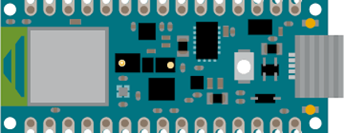

# Trash Detector

Trash Detector ist ein Uniprojekt im Rahmen des HTW Wahlpflicht-Mastermoduls Wissensmanagement im Studiengang Wirtschaftsinformatik. Inhalt und Ziel des Moduls war die Erstellung eines Hardware-Prototypen mit einem Microcontroller und die Verwendung von Machine Learning.

*Hinweis: Der hier vorgestellte Prototyp basiert zu diesem Zeitpunkt auf hard-gecodeten Ausgabewerten und gibt keine Echtdaten aus. Dies kann jedoch erzielt werden, wenn eine Hardware mit mehr Arbeitsspeicher verwendet wird. Die hier verwendete Hardware bietet nur einen begrenzten Speicher von 1 MB an.*

## 1 Einleitung
Müll ist ein globales Problem, das sich auf die Umwelt und die Gesellschaft auswirkt. Der Anstieg des Müllaufkommens und die begrenzten Möglichkeiten zur Entsorgung haben negative Auswirkungen auf die Gesundheit der Menschen, die Tiere und die Umwelt.(1) Um diesen Herausforderungen zu begegnen, haben sich viele Länder und Unternehmen darauf konzentriert, Technologien und Verfahren zur Müllerkennung und zum Recycling zu entwickeln.(2) Müllerkennungs- und Recyclingtechnologien helfen dabei, Abfall zu reduzieren, wertvolle Ressourcen zurückzugewinnen und die Umweltbelastung zu minimieren. In diesem Zusammenhang sind auch innovative Lösungen wie künstliche Intelligenz und maschinelles Lernen im Bereich der Müllerkennung und des Recyclings auf dem Vormarsch.\
Dieses Projekt ist ein Prototyp und der erste Schritt für die Verwendung von Technologien zur Müllerkennung.

### 1.1 Motivation
Müllentsorgung ist ein großes Problem, das die Umwelt und die Gesellschaft auf vielfältige Weise beeinflusst. Doch mithilfe von Technologie können Vebraucher dabei unterstützt werden, bereits während der Entsorgung zum Recycling und somit zu einer nachhaltigeren Welt beizutragen. Dieser Protoyp soll ein erster Schritt für den Einsatz von Microcontrollern in der Müllerkennung sein, um Abfall zu reduzieren, wertvolle Ressourcen zurückzugewinnen und die Umweltbelastung zu minimieren. 

### 1.2 Ziel des Projektes
Das Ziel dieses Projektes ist die Müllerkennung mithilfe von Machine Learning (TinyML) und eines Microcontrollers.
Die Effizienz und Effektivität der Müllsortierung soll verbessert werden und dadurch ein Beitrag zu einer nachhaltigeren Zukunft geleistet werden. Durch die Verwendung von Microcontrollern zur Müllerkennung und zum Recycling kann Abfall besser klassifiziert werden und somit eine automatische Trennung und Weiterverarbeitung von Abfall ermöglichen. Dies wiederum reduziert die Müllentsorgungskosten, maximiert den Wert wiederverwendbarer Ressourcen und reduziert die Umweltbelastung.

Konkret soll der Prototyp dazu beitragen, dass der Müllsortierprozess effizienter wird, indem er die Müllerkennung automatisiert und somit menschliche Fehler minimiert. Durch die Erkennung von verschiedenen Müllarten auf der Grundlage von Merkmalen wie Farbe, Form und Struktur kann eine automatische Trennung und Weiterverarbeitung von Abfall ermöglicht werden. Dadurch wird die Wiederverwendung von recycelbaren Materialien gefördert und der Anteil des in Deponien entsorgten Abfalls reduziert werden.

Ziel ist nicht die Erstellung eines fertigen Prototypen oder eine vollwertig funktionierende Hard- und/oder Software.

## 2 Aufbau und Vorbereitung des Prototypen
In diesem Abschnitt wird gezeigt, welche Vorbereitungen getroffen werden müssen, um den Prototypen zum Laufen zu bringen.

### 2.1 Hardwarekomponenten

### 2.2 Edge Impulse
- beschreibung wofür
- registrierung
- projekt anlegen

### 2.3 Arduino IDE
- download
- alle libraries installieren
- wofür brauchen wir die ide im projekt

## 3 Umsetzung und Anleitung

### 3.1 Hardware vorbereiten
- flashen
- edge impulse cmd
- triber für kamera
- triber für m5stick

### 3.2 Datensatz erstellen
- handy mit edge impulse verbinden
- fotos aufnehmen mit richtigem lable

### 3.3 Modell trainieren
- training
- testen
- exportieren in arduino ide

### 3.4 Code in Arduino IDE (besseren Titel wählen)

#### 3.4.1 Müllerkennung
- import modell zip als library
- über examples code für kamera öffnen
- auf nano spielen
- in serial monitor ausgabe anzeigen

#### 3.4.2 Bluetooth auf Nano 33

#### 3.4.3 Bluetooth auf M5Stick

### 3.5 Ausgabe auf M5Stick

## 4 Potenziale und Ausblick

## 5 Trouble shooting

## Literaturverzechnis

1) Alam, P. and Ahmade, K., 2013. Impact of solid waste on health and the environment. International Journal of Sustainable Development and Green Economics (IJSDGE), 2(1), pp.165-168.

2) de Souza Melaré, A.V., González, S.M., Faceli, K. and Casadei, V., 2017. Technologies and decision support systems to aid solid-waste management: a systematic review. Waste management, 59, pp.567-584.
