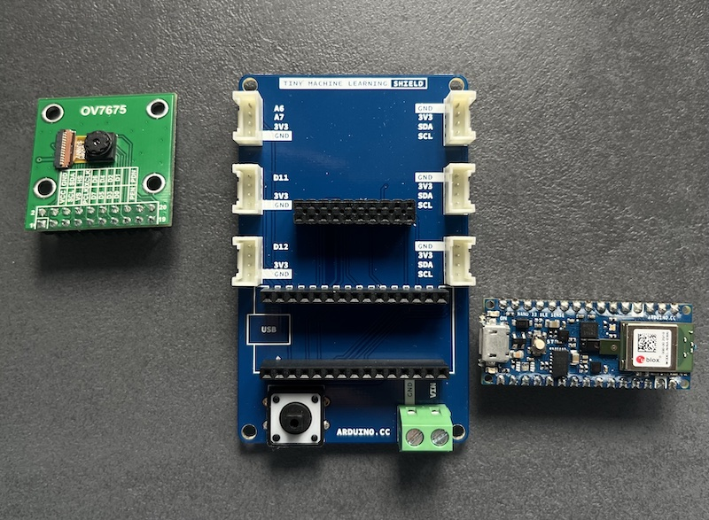

# Trash Detector
Trash Detector ist ein Uniprojekt im Rahmen des HTW Wahlpflicht-Mastermoduls Wissensmanagement im Studiengang Wirtschaftsinformatik. Inhalt und Ziel des Moduls war die Erstellung eines Hardware-Prototypen mit einem Microcontroller und die Verwendung von Machine Learning.

*Hinweis: Der hier vorgestellte Prototyp basiert zu diesem Zeitpunkt auf hard-gecodeten Ausgabewerten und gibt keine Echtdaten aus. Dies kann jedoch erzielt werden, wenn eine Hardware mit mehr Arbeitsspeicher verwendet wird. Die hier verwendete Hardware bietet nur einen begrenzten Speicher von 1 MB an.*

## 1 Einleitung
Müll ist ein globales Problem, das sich auf die Umwelt und die Gesellschaft auswirkt. Der Anstieg des Müllaufkommens und die begrenzten Möglichkeiten zur Entsorgung haben negative Auswirkungen auf die Gesundheit der Menschen, die Tiere und die Umwelt.(1) Um diesen Herausforderungen zu begegnen, haben sich diverse Länder und Unternehmen darauf konzentriert, Technologien und Verfahren zur Müllerkennung und zum Recycling zu entwickeln.(2) Müllerkennungs- und Recyclingtechnologien helfen dabei, Abfall zu reduzieren, wertvolle Ressourcen zurückzugewinnen und die Umweltbelastung zu minimieren. In diesem Zusammenhang sind auch innovative Lösungen wie künstliche Intelligenz und maschinelles Lernen im Bereich der Müllerkennung und des Recyclings auf dem Vormarsch.\
Dieses Projekt ist ein Prototyp und der erste Schritt für die Verwendung von Technologien zur Müllerkennung.

### 1.1 Motivation
Mithilfe von Technologie können Vebraucher dabei unterstützt werden, bereits während der Entsorgung von Müll ihren Teil zum Recycling und somit zu einer nachhaltigeren Welt beizutragen. Dieser Protoyp soll ein erster Schritt für den Einsatz von Microcontrollern in der Müllerkennung sein, um Abfall zu reduzieren, wertvolle Ressourcen zurückzugewinnen und die Umweltbelastung zu minimieren. 

### 1.2 Ziel des Projektes
Das Ziel dieses Projektes ist die Müllerkennung mithilfe von Machine Learning (TinyML) und eines Microcontrollers.
Die Effizienz und Effektivität der Müllsortierung soll verbessert werden und dadurch ein Beitrag zu einer nachhaltigeren Zukunft geleistet werden. Durch die Verwendung von Microcontrollern zur Müllerkennung und zum Recycling kann Abfall besser klassifiziert werden und somit eine automatische Trennung und Weiterverarbeitung von Abfall ermöglichen. Dies wiederum reduziert die Müllentsorgungskosten, maximiert den Wert wiederverwendbarer Ressourcen und reduziert die Umweltbelastung.

Konkret soll der Prototyp dazu beitragen, dass der Müllsortierprozess effizienter wird, indem er die Müllerkennung automatisiert und somit menschliche Fehler minimiert. Durch die Erkennung von verschiedenen Müllarten auf der Grundlage von Merkmalen wie Farbe, Form und Struktur kann eine Trennung und Weiterverarbeitung von Abfall ermöglicht werden.

Umgesetzt wird dies durch die visuelle Aufnahme von verschiedenen Müllarten. Bildmaterial von Müll wird dabei klassifiziert und erhalten Labels, womit später das TinyML-Modell trainiert und getestet wird. Über die Kamera wird nahezu live der Müll erkannt und die Müllart auf einem separaten Display ausgegeben.

Ziel ist nicht die Erstellung eines fertigen Prototypen oder eine vollwertig funktionierende Hard- und/oder Software.

## 2 Aufbau und Vorbereitung des Prototypen
In diesem Abschnitt wird gezeigt, welche Vorbereitungen getroffen werden müssen, um den Prototypen zum Laufen zu bringen.

### 2.1 Hardwarekomponenten
Für den Prototypen sind drei Hardwarekomponenten relevant, um den Müll zu erkennen und die erkannte Müllart auf einem Display auszugeben:
1. Microcontroller Nano 33 BLE Sense
2. Kameramodul OV7675
3. M5StickC PLUS.

Die Kommunikation zwischen dem Nano 33 und dem M5Stick wird über Bluetooth umgesetzt, wobei der Nano 33 als zentrales Gerät und der M5Stick als Peripheriegerät fungiert.

1. Der Microcontroller Nano 33 BLE Sense von Arduino ist das Herzstück des ganzen. Auf diesem Controller wird der Code für die Erkennung des Mülls raufgespielt und zusätzlich der Code für die Bluetoothkommunikation zum Display (M5StickC PLUS). \


2. Das Kameramodul dient zur Aufnahme des Objekts. \


3. Zum Anzeigen der erkannten Müllart wird der M5Stick C PLUS verwendet. In ihm steckt ein ESP-32-PICO Mini. Für die Bluetoothkommunikation wird hierauf der Peripheriecode gespielt. \


Der Microcontroller und das Kameramodul können über ein Board, das sogenannte *Tiny Machine Learning Shield*, verbunden werden.\
 \


### 2.2 Edge Impulse
- beschreibung wofür
- registrierung
- projekt anlegen

### 2.3 Arduino IDE
- download
- alle libraries installieren
- wofür brauchen wir die ide im projekt

## 3 Umsetzung und Anleitung
In diesem Abschnitt wird die Müllerkennung umgesetzt.

### 3.1 Hardware vorbereiten
- flashen
- edge impulse cmd
- triber für kamera
- triber für m5stick

1. Firmware Nano 33 BLE Sense aktualisieren
Es kann notwendig sein, ersteinmal die aktuelle Firmware des Nano zu aktualisieren und zu flashen. Dafür folgende zip-Datei herunterladen und entsprechendes Script für das eigene Betriebssystem öffnen: [Nano 33 BLE Sense board Edge Impulse firmware](https://cdn.edgeimpulse.com/firmware/arduino-nano-33-ble-sense.zip "Nano 33 BLE Sense firmware").

(Screenshot von flashen einfügen)

2. Verbinden zu Edge Impulse
In cmd/Terminal folgenden Befehl eingeben, um den Nano mit Edge Impulse zu verbinden.
```
edge-impulse-daemon
```
(Screenshot von temrinal einfügen)

3. Triber für Kameramodul/USB-Anschluss runterladen: \
[USB-Treiber von SiLabs](https://www.silabs.com/developers/usb-to-uart-bridge-vcp-drivers "USB-Treiber von SiLabs")

4. Triber/Library für M5Stick
* USB-Triber runterladen: https://ftdichip.com/drivers/vcp-drivers/
> Ggfs. muss die Sicherheitseinstellung unter macOS angepasst werden. \
> System Preferences -> Security and Privacy -> General -> Allow downloadable apps from the following locations -> App Store and Approved Developer Options

* Arduino IDE öffnen und auf *Arduino IDE -> Settings* gehen und folgenden Link in die Sektion *Additional boards manager URLs* einfügen: https://m5stack.oss-cn-shenzhen.aliyuncs.com/resource/arduino/package_m5stack_index.json

* Nun Boardtreiber für den M5StickC installieren. Dazu unter *Boards Manager* nach *M5Stack* suchen und vorgeschlagenes Board installieren.
(Screenshot)

* Nun unter *Tools -> Board: ... -> M5Stack -> M5Stick-C-Plus* auswählen.

* Anschließend die Library installieren. Dazu unter *Library Manager* nach M5StickCPlus suchen und vorgeschlagene Library installieren.
(Screenshot)

### 3.2 Datensatz erstellen
- handy mit edge impulse verbinden
- fotos aufnehmen mit richtigem lable

 \


### 3.3 Modell trainieren
- training
- testen
- exportieren in arduino ide

### 3.4 Code in Arduino IDE (besseren Titel wählen)

#### 3.4.1 Müllerkennung
- import modell zip als library
- über examples code für kamera öffnen
- auf nano spielen
- in serial monitor ausgabe anzeigen


#### 3.4.2 Bluetooth auf Nano 33

#### 3.4.3 Bluetooth auf M5Stick

### 3.5 Ausgabe auf M5Stick

## 4 Potenziale und Ausblick

NOCH NOTIZEN:
Dadurch wird die Wiederverwendung von recycelbaren Materialien gefördert und der Anteil des in Deponien entsorgten Abfalls reduziert werden.

## 5 Trouble shooting

## Literaturverzechnis

1) Alam, P. and Ahmade, K., 2013. Impact of solid waste on health and the environment. International Journal of Sustainable Development and Green Economics (IJSDGE), 2(1), pp.165-168.

2) de Souza Melaré, A.V., González, S.M., Faceli, K. and Casadei, V., 2017. Technologies and decision support systems to aid solid-waste management: a systematic review. Waste management, 59, pp.567-584.
